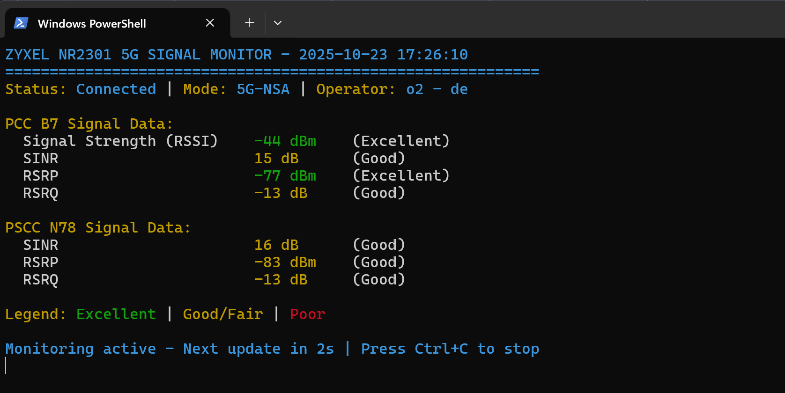

# Zyxel NR2301 5G Router Signal Tracker



A Python script to monitor live signal data from the Zyxel NR2301 5G portable router with color-coded display for easy signal quality assessment.
It can help you to position your router on better spot for better signal strength

## Features

- 🔐 **Secure Authentication**: Prompts for router credentials securely (password hidden)
- 📊 **Real-time Monitoring**: Continuously monitors signal strength and quality metrics
- 🎨 **Color-coded Display**: Green for excellent, yellow for good/fair, red for poor signal quality
- 📈 **Signal Quality Assessment**: Provides quality ratings (Excellent/Good/Fair/Poor) for each metric
- 🔊 **Audio Feedback**: Optional audio notifications for signal quality (excellent/good/bad)
- 📝 **Data Logging**: Saves signal data to JSON file for analysis
- 🔄 **Continuous Monitoring**: Optional continuous monitoring with configurable refresh intervals
- 📖 **Educational**: Includes explanations of all signal metrics

## Signal Metrics Explained

- **RSSI (Received Signal Strength Indicator)**: Measures the power level of the received signal. Higher values (closer to 0) are better.
- **RSRP (Reference Signal Received Power)**: Measures the power level of reference signals. Higher values (closer to 0) are better.
- **RSRQ (Reference Signal Received Quality)**: Measures the quality of the received signal. Higher values (closer to 0) are better.
- **SINR (Signal-to-Interference-plus-Noise Ratio)**: Measures signal quality relative to noise and interference. Higher values are better.

## Signal Quality Thresholds

| Metric | Excellent | Good | Fair | Poor |
|--------|-----------|------|------|------|
| RSSI   | ≥ -50 dBm | ≥ -70 dBm | ≥ -85 dBm | < -85 dBm |
| RSRP   | ≥ -80 dBm | ≥ -90 dBm | ≥ -100 dBm | < -100 dBm |
| RSRQ   | ≥ -10 dB  | ≥ -15 dB  | ≥ -20 dB  | < -20 dB  |
| SINR   | ≥ 20 dB   | ≥ 13 dB   | ≥ 0 dB    | < 0 dB    |

## Requirements

- Python 3.7+
- Chrome browser
- ChromeDriver (automatically managed by Selenium)
- Network access to the router (192.168.1.1 or zyxel.home)
- Router admin credentials (username and password)

## Installation

1. **Clone or download the project files**
   ```bash
   git clone <repository-url>
   cd router-signal
   ```

2. **Install Python dependencies**:
   ```bash
   pip install -r requirements.txt
   ```

3. **Test the installation**:
   ```bash
   python test_installation.py
   ```

4. **Prepare audio files (optional)**:
   - Place your audio files in the `sound/` directory:
     - `sound/excellent_signal.wav` - for excellent signal quality
     - `sound/good_signal.wav` - for good signal quality  
     - `sound/bad_signal.wav` - for poor signal quality

## Usage

### Basic Usage

Run the signal tracker:
```bash
python signal.py
```

The script will prompt you for your router credentials on first run:
- **Username**: Enter your router admin username (default: admin)
- **Password**: Enter your router admin password (hidden input)

### Menu Options

1. **Get single signal reading**: Retrieves current signal data once
2. **Start continuous monitoring**: Continuously monitors signal with configurable refresh interval
3. **Test login only (debug)**: Test router connection without monitoring
4. **Toggle audio feedback**: Enable/disable audio notifications
5. **Exit**: Quit the application

### Command Line Options

- `--debug` or `-d`: Enable debug mode (browser visible)
- `--no-audio` or `-na`: Disable audio feedback

### Configuration

The script uses the following default settings:
- **Router URL**: `http://192.168.1.1` (automatically tries `http://zyxel.home` if needed)
- **Audio Feedback**: Enabled by default
- **Debug Mode**: Disabled by default

To modify these settings, you can:
1. Edit the `RouterSignalTracker` initialization in the `main()` function
2. Use command line arguments for debug mode and audio feedback
3. Change router URL in the code if your router uses a different IP

## Output

The script provides:

1. **Real-time Display**: Color-coded signal data with quality ratings
2. **JSON Logging**: Signal data saved to `signal_data.json`
3. **Console Logging**: Detailed logs saved to `router_signal.log`

### Sample Output

```
============================================================
ZYXEL NR2301 5G ROUTER SIGNAL MONITOR
Last Updated: 2024-01-15 14:30:25
============================================================

📡 CONNECTION INFORMATION
------------------------------
Connection Status    : Connected
RAT Mode            : 5G-NSA
Network Operator    : o2 - de
IMSI               : [Unique IMSI Number]
Operation Band     : PCC B7, PSCC N78

📶 PCC B7 SIGNAL DATA
------------------------------
Signal Strength (RSSI) : -40 dBm (Excellent)
SINR                   : 22 dB (Excellent)
RSRP                   : -69 dBm (Excellent)
RSRQ                   : -9 dB (Excellent)

📶 PSCC N78 SIGNAL DATA
------------------------------
SINR                   : 16 dB (Good)
RSRP                   : -80 dBm (Excellent)
RSRQ                   : -12 dB (Good)
```

## Troubleshooting

### Common Issues

1. **Chrome WebDriver not found**:
   - Install Chrome browser
   - ChromeDriver is automatically managed by Selenium

2. **Connection timeout**:
   - Ensure the router is accessible at 192.168.1.1
   - Check network connectivity
   - Verify router credentials

3. **Login failed**:
   - Verify username and password
   - Check if router interface has changed

### Logs

Check the following files for detailed error information:
- `router_signal.log`: Application logs
- `signal_data.json`: Latest signal data

## File Structure

```
router-signal/
├── signal.py              # Main application
├── test_installation.py   # Installation test script
├── requirements.txt       # Python dependencies
├── README.md             # This file
├── sound/                # Audio feedback files (optional)
│   ├── excellent_signal.wav
│   ├── good_signal.wav
│   └── bad_signal.wav
├── signal_data.json      # Latest signal data (generated)
└── router_signal.log     # Application logs (generated)
```

## Dependencies

- `selenium>=4.0.0`: Web automation framework
- `colorama>=0.4.4`: Cross-platform colored terminal output
- `pygame>=2.0.0`: Audio playback (optional, falls back to winsound on Windows)
- `beautifulsoup4>=4.9.0`: HTML parsing (included for future use)
- `requests>=2.25.0`: HTTP library (included for future use)
- `lxml>=4.6.0`: XML/HTML parser (included for future use)

## Security Notes

- **Credentials**: The script prompts for credentials securely and does not store them
- **Password Input**: Passwords are entered using hidden input (getpass) for security
- **No Hardcoded Secrets**: No passwords or sensitive data are stored in the code
- **Local Use Only**: This script is designed for local network monitoring only

## License

This project is provided as-is for educational and monitoring purposes.

## Support

For issues or questions:
1. Check the troubleshooting section
2. Review the log files
3. Ensure all dependencies are properly installed
